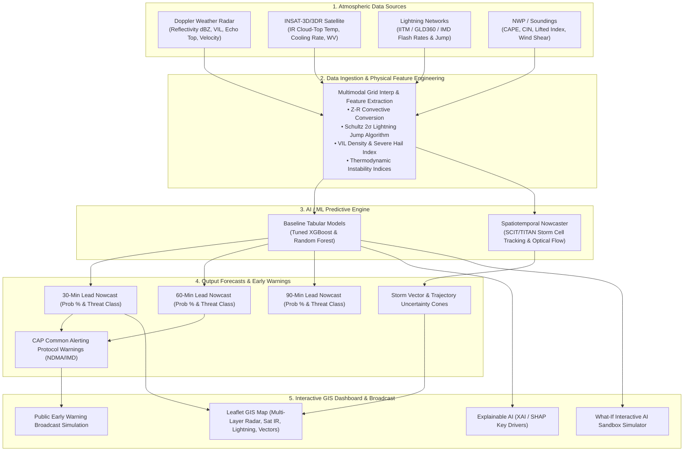

# ⚡ Aerocast-AI: Multimodal Thunderstorm & Lightning Nowcasting Platform

> **AIML-based Nowcasting of Severe Thunderstorms and Lightning Using Atmospheric Observations (Multiple Doppler Weather Radars, Geostationary Satellite, Lightning Detection Networks, and Numerical Weather Prediction Models).**

---

## 📌 1. Project Overview & Architecture

**Aerocast-AI** is an operational, end-to-end meteorological AI/ML nowcasting system built to address the Smart India Hackathon (SIH) Problem Statement. It delivers short-term (0–90 minute) localized forecasts of convective storm formation, severe lightning risk, hail potential, and storm cell trajectory tracking.



---

## 🔬 2. Meteorological Science & Physics Grounding

Rather than treating weather as arbitrary numbers, Aerocast-AI embeds proven meteorological principles:

1. **Radar Reflectivity & Hydrometeor Mass**:
   - Convective $Z-R$ relation: $Z = 300 R^{1.4} \implies R = (10^{Z/10} / 300)^{1/1.4}$ mm/hr.
   - Core threshold: $Z \ge 35\text{ dBZ}$ (convective initiation), $Z \ge 45\text{ dBZ}$ (heavy rain/lightning), $Z \ge 55\text{ dBZ}$ (severe storm / hail).
   - **VIL Density**: $\text{VIL Density} = \frac{\text{VIL}}{\text{Echo Top} \times 1000} \times 1000\text{ g/m}^3$ ($> 3.5\text{ g/m}^3$ indicates severe hail core).

2. **Satellite Cloud-Top Rapid Cooling**:
   - INSAT-3D Infrared channel ($10.8\,\mu\text{m}$) brightness temperature ($T_{bb}$).
   - Vigorous updrafts produce cooling rates $\frac{dT_{bb}}{dt} \le -5^\circ\text{C} / 15\text{ min}$ with overshooting tops reaching $< -65^\circ\text{C}$.

3. **Schultz Lightning Jump Algorithm ($2\sigma$)**:
   - Severe weather and downbursts are preceded by sudden spikes in total lightning flash rates ($15-30\text{ min}$ lead time).
   - Evaluates $\Delta F / \sigma \ge 2.0$ with $F(t) \ge 10\text{ flashes/min}$.

4. **Thermodynamic Convective Instability**:
   - **CAPE** ($> 2000\text{ J/kg}$ indicates high potential energy).
   - **CIN** ($< 50\text{ J/kg}$ indicates weak cap allowing initiation).
   - **Lifted Index** ($< -4^\circ\text{C}$ indicates buoyant updrafts).

---

## 📊 3. Model Architecture & Meteorological Verification Metrics

Trained and evaluated on multi-sensor dataset with holdout test verification ($N=1,250$):

| Lead Time Horizon | ROC-AUC Score | Accuracy | Precision | Probability of Detection (POD) | Critical Success Index (CSI / Threat Score) | False Alarm Ratio (FAR) |
| :--- | :---: | :---: | :---: | :---: | :---: | :---: |
| **+30 Minutes** | **0.8811** | **89.92%** | **91.78%** | **97.16%** | **0.8939** | **0.0822** |
| **+60 Minutes** | **0.9215** | **92.72%** | **94.43%** | **97.57%** | **0.9226** | **0.0557** |
| **+90 Minutes** | **0.8737** | **84.96%** | **88.13%** | **93.35%** | **0.8292** | **0.1187** |

- **Lightning Risk 4-Class Classification Accuracy**: **99.52%**
- **Overall Multi-Lead ROC-AUC**: **0.8921**

### Feature Importance Breakdown (SHAP / Gain):
1. **Radar Core Reflectivity (`max_reflectivity_dbz`)**: `25.9%`
2. **Vertically Integrated Liquid (`vil_kg_m2`)**: `16.6%`
3. **Lifted Index (`lifted_index`)**: `7.3%`
4. **Convective Inhibition (`cin_j_kg`)**: `5.2%`
5. **Satellite Cloud Top Temp (`cloud_top_temp_c`)**: `4.6%`
6. **Radar Echo Top (`echo_top_km`)**: `3.7%`
7. **Lightning Flash Rate (`flash_rate_per_min`)**: `3.5%`

---

## 🌐 4. Operational Regions Supported (IMD DWR Stations)

- 📍 **Hyderabad & Telangana Region** (DWR Begumpet, IMD) — Pre-monsoon/Monsoon convective cells.
- 📍 **Kolkata & Gangetic West Bengal** (DWR Alipore, IMD) — Kalbaisakhi / Nor'wester severe squall lines.
- 📍 **Delhi-NCR & Western UP** (DWR Mausam Bhawan / Palam, IMD) — Northern plains convective gust fronts.
- 📍 **Bhubaneswar & Coastal Odisha** (DWR Paradip, IMD) — Bay of Bengal sea-breeze convection.

---

## 🚀 5. Quick Start & Execution

### Prerequisites:
- Python 3.10+
- Dependencies installed via pip (`pip install fastapi uvicorn scikit-learn pandas scipy xgboost`)

### 1. Launch Platform Server:
```bash
python run_server.py
```
Or with uvicorn:
```bash
python -m uvicorn backend.app.main:app --host 127.0.0.1 --port 8000 --reload
```

### 2. Access GIS Dashboard:
Open your browser at **[http://127.0.0.1:8000](http://127.0.0.1:8000)**

### 3. Run Test Suite:
```bash
python backend/test_api.py
python backend/test_e2e.py
```

---

## 🖥️ 6. Key Features Demonstrated in UI

1. **Interactive GIS Map**: Multi-layer toggles for IMD Radar (dBZ), INSAT-3D Satellite (CTT), Lightning Strikes (CG/IC), and Storm Vector / Uncertainty Cones.
2. **Timeline Playback**: Step through observations ($t-60\text{m} \to t_0$) and nowcasts ($+15\text{m} \to +90\text{m}$) with animated storm cell evolution.
3. **AI Threat Assessment**: Real-time storm probability gauge, lightning threat severity, motion vectors, and Schultz 2σ Lightning Jump status.
4. **Explainable AI (XAI)**: Contextual breakdown explaining *why* the AI assigned the probability.
5. **Interactive "What-If" AI Sandbox**: Real-time sliders allowing judges/meteorologists to simulate custom atmospheric instability and see instant AI model reactions.
6. **CAP Early Warning Broadcast Simulator**: Common Alerting Protocol (CAP) compliant mobile/SMS alert previews with NDMA life-safety directives.
7. **Model Verification Stats**: Live ROC-AUC, CSI threat score, POD, FAR, confusion matrix, and feature importance inspection.
